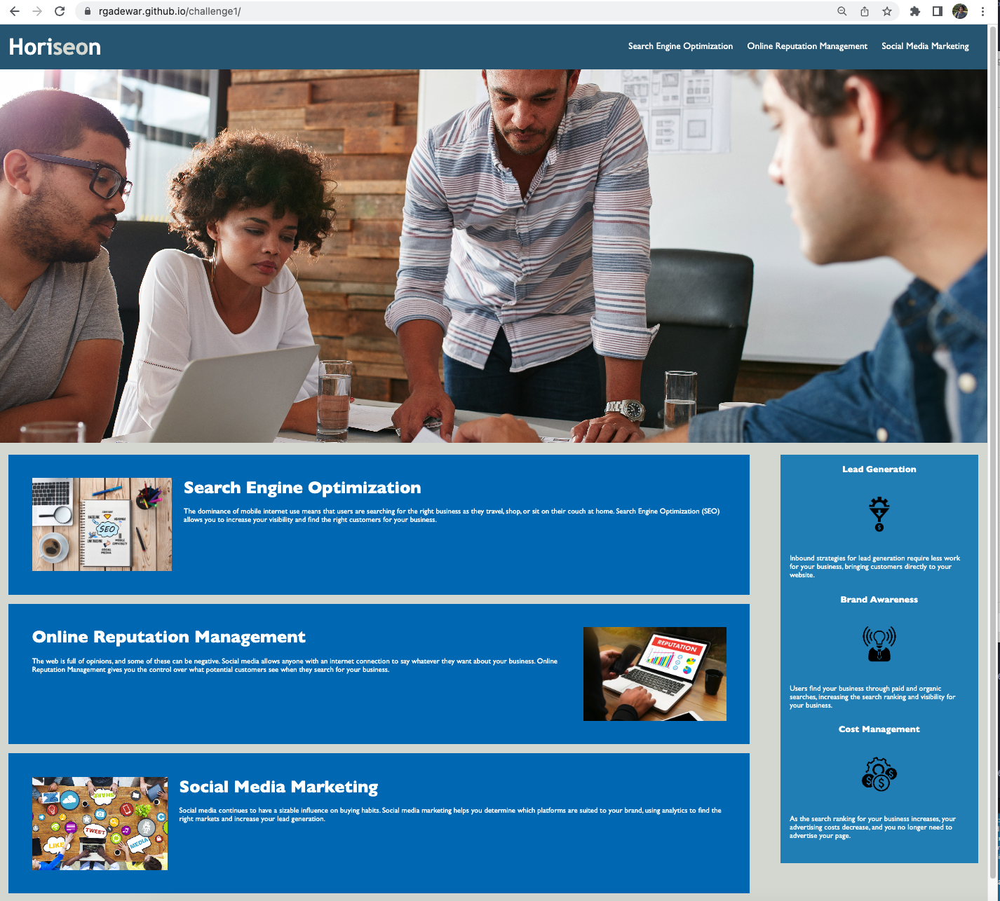
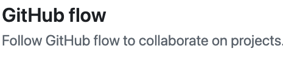

# challenge1
## Description
In this section, I have learned about HTML and diffrent CSS elements. I have practiced Git workflows, User stories, professional read me.
- [Website Preview](#website-preview)
- [Credits](#credits)
    - [CSS Information](#css-information)
    - [CSSBox Information](#cssbox-information)
    - [Git Cheat Sheet](#git-cheat-sheet-pdf)
    - [Git Flow Process](#git-flow-process)
    - [HTML Reference](#html-reference)
- [License](#license)
- [How To Contribute](#how-to-contribute)
## Website Preview
[Horiseon Website Link](https://estee3.github.io/Accessability-Refactoring/)

## Credits
NOTE: Click preview pictures to navigate to the referenced site
### CSS Information

### CSSBox Information

### Git Cheat Sheet (pdf)

### Git Flow Process

### HTML Reference

## License
MIT License
Copyright (c) [year] [fullname]
Permission is hereby granted, free of charge, to any person obtaining a copy
of this software and associated documentation files (the "Software"), to deal
in the Software without restriction, including without limitation the rights
to use, copy, modify, merge, publish, distribute, sublicense, and/or sell
copies of the Software, and to permit persons to whom the Software is
furnished to do so, subject to the following conditions:
The above copyright notice and this permission notice shall be included in all
copies or substantial portions of the Software.
THE SOFTWARE IS PROVIDED "AS IS", WITHOUT WARRANTY OF ANY KIND, EXPRESS OR
IMPLIED, INCLUDING BUT NOT LIMITED TO THE WARRANTIES OF MERCHANTABILITY,
FITNESS FOR A PARTICULAR PURPOSE AND NONINFRINGEMENT. IN NO EVENT SHALL THE
AUTHORS OR COPYRIGHT HOLDERS BE LIABLE FOR ANY CLAIM, DAMAGES OR OTHER
LIABILITY, WHETHER IN AN ACTION OF CONTRACT, TORT OR OTHERWISE, ARISING FROM,
OUT OF OR IN CONNECTION WITH THE SOFTWARE OR THE USE OR OTHER DEALINGS IN THE
SOFTWARE.
---
## How to Contribute
[Contributor Covenant](https://www.contributor-covenant.org/)
developer.mozilla.orgdeveloper.mozilla.org
CSS: Cascading Style Sheets | MDN
Cascading Style Sheets (CSS) is a stylesheet language used to describe the presentation of a document written in HTML or XML (including XML dialects such as SVG, MathML or XHTML). CSS describes how elements should be rendered on screen, on paper, in speech, or on other media.
https://developer.mozilla.org/en-US/docs/Web/CSS

developer.mozilla.orgdeveloper.mozilla.org
The box model - Learn web development | MDN
That's most of what you need to understand about the box model. You may want to return to this lesson in the future if you ever find yourself confused about how big boxes are in your layout. (24 kB)
https://developer.mozilla.org/en-US/docs/Learn/CSS/Building_blocks/The_box_model

GitHub DocsGitHub Docs
GitHub flow - GitHub Docs
Follow GitHub flow to collaborate on projects. (7 kB)
https://docs.github.com/en/get-started/quickstart/github-flow